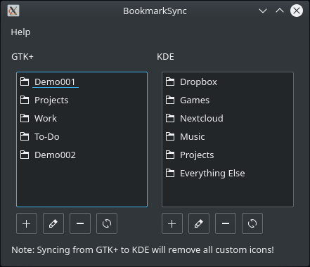

# bookmarksync

BookmarkSync is a simple program that manages GTK+ and KDE bookmarks.



## Build instructions

To compile BookmarkSync you will need qmake and the headers for Qt 5, KDE Plasma 5, and KIO.

On Debian and derivatives, this is `apt install qtbase5-dev kdelibs5-dev libkf5kio-dev`.

Then,

```shell
git clone https://github.com/jlu5/bookmarksync
cd bookmarksync/src
qmake
make -j$(nproc)
```

The resulting binary will be named `bookmarksync`.


Alternatively, you can build the project (`bookmarksync.pro`) using Qt Creator.
